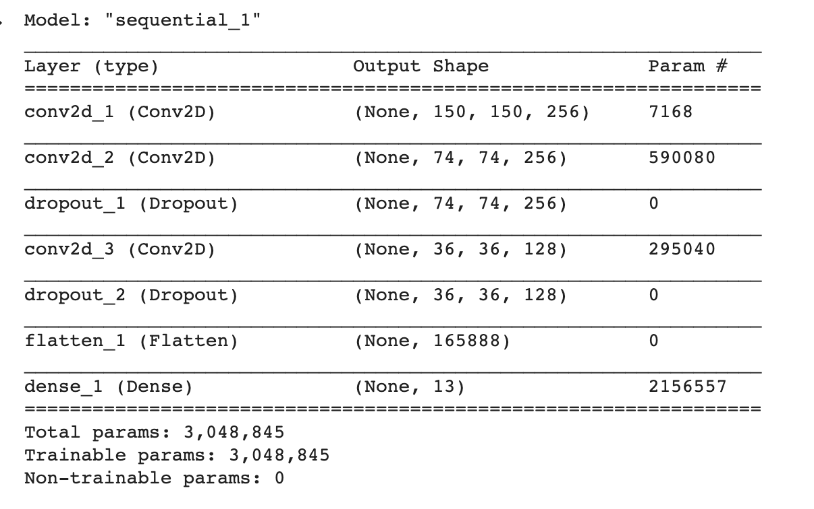
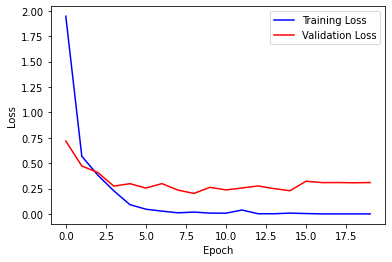
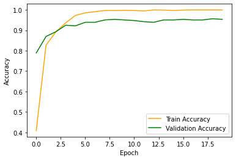
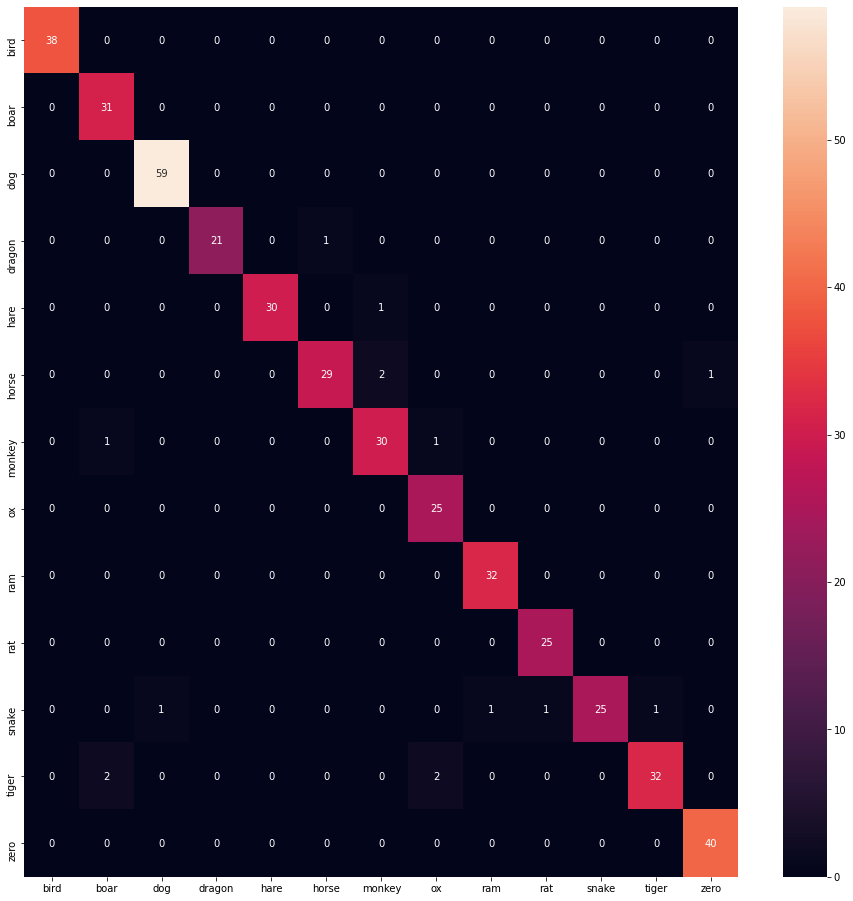

# Naruto Hand Sign Prediction using CNN

A custom CNN to classify Naruto Hand Signs. The data set contains roughly around 2100 images and I used a test split of 0.2 and validation split of 0.2 in the train
set. Achieved validation accuracy of 0.95 and test accuracy of 0.96

<b>Dataset: </b>
[Kaggle Link](https://www.kaggle.com/vikranthkanumuru/naruto-hand-sign-dataset)

<b> Model Summary </b>


# Plots






Download model from [here](https://drive.google.com/file/d/1qqG3WKFhdT4wVX7q7nOQE77AIeyZ36Db/view?usp=sharing)


# Instructions to Load the Model
To load model type the following code
```
import pickle

#filename - path to the model
loaded_model = pickle.load(open(filename, 'rb'))

```


<h2>Note</h2>

The html design of the current app is taken from this [repo](https://github.com/shlokshah/Traffic-Sign-Detection).
